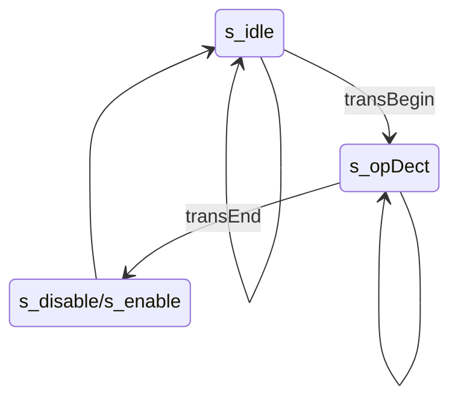
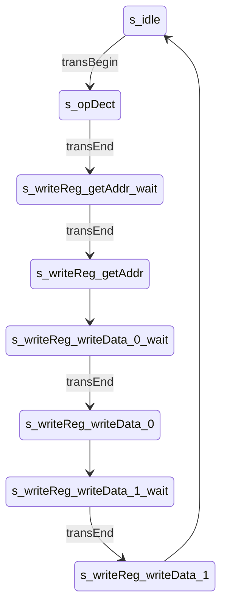
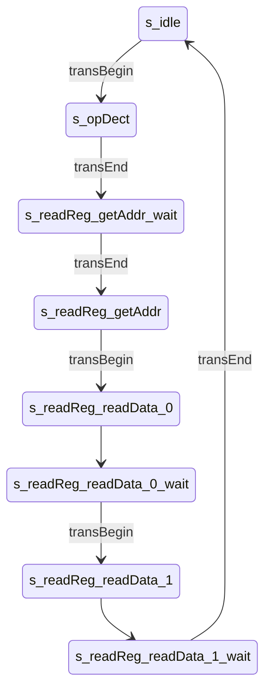
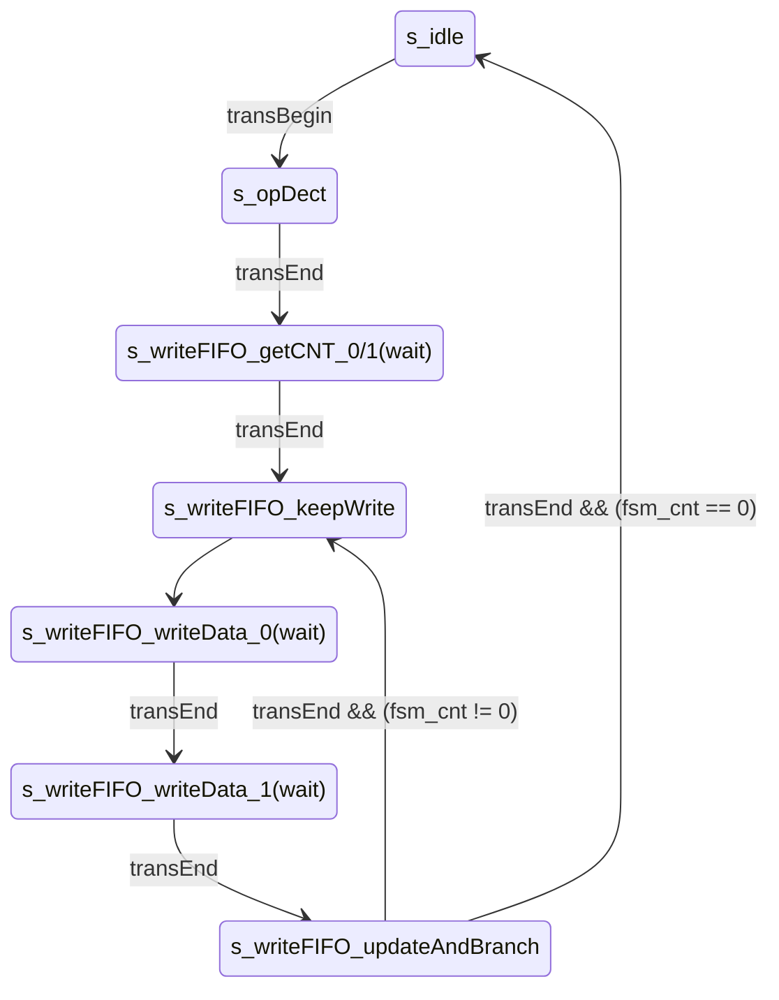
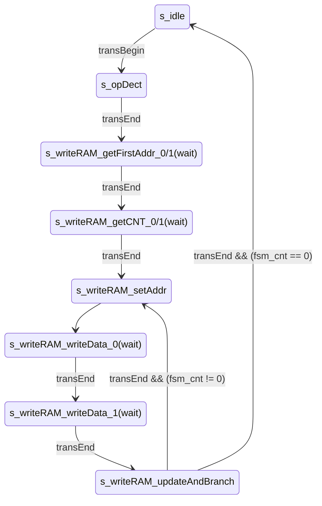

[en](./README.md) | [简中](./README_cn.md)

# simple spi communication between FPGA and  MCU

## 0. Intro

This repository implements two SPI-based communication methods between FPGA and MCU: SRAM-like interface and instruction parsing.

In either way, the MCU implements control of the FPGA by modifying the values of some control registers inside the FPGA. In the SRAM-like interface approach, read or write operations to the target registers are achieved through specific addresses. In the instruction parsing approach, the instruction sent by the MCU is parsed through the state machine to achieve read or write to the target register.

This repository is divided into two parts. essential part implements the basic read and write functions, including registers, FIFO and DPRAM. simpleDSP part implements some simple digital signal processing functions (todo), including signal sampling, FFT and IFFT, FIR filtering.

In this experiment, Intel's IP cores are used and the corresponding simulations are provided. The specific hardware and software platforms are shown in the following table: 

| Platform     |                 |
| ------------ | --------------- |
| FPGA         | EP4CE15         |
| MCU          | STM32F407       |
| **Software** |                 |
| Quartus      | 18.1.1 Standard |
| Keil         |                 |
| STM32CubeMX  | 6.5.0           |

## 1. Catalog

**Some files cannot be found because they are not yet done.**

```
FPGA_MCU_SPI_COM
├── LICENSE
├── README.assert                   // image in README
├── README.md
├── essential                       // 
│   ├── alt_ip                      // used IP core
│   ├── Inst_pars                   // 
│   │   ├── RTL                     // RTL implementation
│   │   ├── mcu_driver              // 
│   │   └── sim
│   │       ├── modelsim_prj
│   │       │   ├── run.do          // sim script
│   │       │   └── wave.do         // wave script
│   │       ├── run.bat             // bootup script
│   │       └── tb_main.v
│   └── sram_like                   // 
│      ├─sim
│      ├─fsmc
│      │  ├─mcu_driver
│      │  └─RTL
│      └─spi
│          ├─mcu_driver
│          └─RTL
└── simpleDSP                       // todo
```

## 2. SPI Module


The SPI module implements the slave mode of spi and only supports mode 0，namely, rising-edge sampling falling-edge switching。By sampling signals such as scl and sel, the rising and falling edges of these signals are judged and the corresponding actions are taken, so the maximum frequency of scl is constrained by clk. For example, if clk takes 50M, the frequency of scl cannot exceed 25M. Since it is only a slave, the FPGA side does not have the ability to initiate transmission to the MCU, when the MCU needs to read data, it needs to send null data to generate the scl clock, and then the data to be read can only appears on the sdo line(FPGA-side, corresponding to MCU-side sdi line).

The ​Data_begin and Data_end signals are used as the start and end flags for communication, and they are also valid flags for Din and Dout port data. Before Data_begin is pulled low, the Din port should be ready for data, otherwise the Din data cannot be loaded by the SPI module in time and the sdo cannot be output correctly. Similarly, the Dout port data should not be read before data_end is pulled high.

## 3. Essential

- simple summation

There are 4 user registers num1, num2, num3 and sum, and sum is the sum of the first three.

- dual clk FIFO

Use Intel's IP cores, configure size to 16 bits * 256, show ahead mode.

- dual port RAM

Using Intel's IP core, the configuration size is 15 bits * 256, distinguishing between read and write clocks, and reading port data without register.

- enable control

Add enable control to the above 3 function.

## 4. SRAM-like Interface

The whole system is divided into three modules: protocol interface, register bank and user function.

The protocol interface module is used to convert external communication protocols to provide a unified read/write interface to the back-end register bank module (addr, wdata, rdata, wen, ren).

The register bank module implements the definition and packaging of user registers, and the functions of reading and writing RAM and FIFO are also implemented in it.

### 4.1. Dual sel SPI

The protocol interface module uses dual sel lines spi_cs_addr and spi_cs_data to distinguish whether the data being transferred is address or data. The address or data is registered at the end of each transfer.


### 4.2. Read and Write

The **register address** is assigned within the register bank module for each register that needs to be accessed via spi. The read or write operation to the register bank module is determined by the transfer address, which is divided into corresponding read and write addresses based on the **register address**. The highest bit of the write address is 0, the highest bit of the read address is 1, and the remaining bits remain the same as the **register address**.

| reg addr | trans addr(8bit，write） | trans addr(8bit，read) |
| -------- | ---------------------- | --------------------- |
| 1        | 1                      | 1+128                 |

For FIFO read and write operations, multiple reads ** or ** writes of data are allowed after the address is specified.

For all write operations, temporal logic is used; for all read operations, combinatorial logic is used.

### 4.3. FSMC

Parallel transfers are logically simpler, eliminating the need to distinguish reads and writes with addresses, and for RAM direct access to each cell. Of course the increase in data lines means more complex hardware design requirements.

fsmc uses SRAM transfer protocol, A mode (OE flip, turn on extended mode in the configuration). 1 mode was not tested.

The protocol interface module converts the asynchronous fsmc to synchronous mode; it is also possible to read and write to registers asynchronously (regBank_async.v)  without going through the protocol interface module. RAM and FIFO ip cores only provide synchronous mode, so async method is not provided.

## 5. Instruction Parsing

- SPI transfer bit width is 8 bits, and the bit width of data in FPGA is 16 bits. SPI module is standard 4-wire SPI.

- Multi-byte data default little endian (low byte first). (⚠ but testbench needs to be set to big endian)

### 5.1. Instruction Design

A total of 8 instructions are designed:

| Inst    | OP(first byte) |
| ------- | -------------- |
| disable | 0x00           |
| enable  | 0x01           |

use to set control register `ren`.

| Inst           | OP(first byte) |         |           |           |
| -------------- | -------------- | ------- | --------- | --------- |
| write register | 0x02           | regAddr | regData_0 | regData_1 |
| read register  | 0x03           | regAddr | 0x00      | 0x00      |

regAddr，internal data register address.

regData_0，regData_1，the byte order is determined by the parameter `isLittleEndian`.

| Inst       | OP(first byte) |           |           |         |         |     |         |         |
| ---------- | -------------- | --------- | --------- | ------- | ------- | --- | ------- | ------- |
| write fifo | 0x04           | dataCnt_0 | dataCnt_1 | data0_0 | data0_1 | ... | dataX_0 | dataX_1 |
| read fifo  | 0x05           | dataCnt_0 | dataCnt_1 | 0x00    | 0x00    | ... | 0x00    | 0x00    |

FIFO read and write with continuous transfer.

dataCnt，16bit，Length of transmitted data.

When the FIFO is full, the excess data is invalid; when the FIFO is empty, only read out 0.

| inst      | OP(first byte) |             |             |           |           |         |         |     |         |         |
| --------- | -------------- | ----------- | ----------- | --------- | --------- | ------- | ------- | --- | ------- | ------- |
| write ram | 0x06           | firstAddr_0 | firstAddr_1 | dataCnt_0 | dataCnt_1 | data0_0 | data0_1 | ... | dataX_0 | dataX_1 |
| read ram  | 0x07           | firstAddr_0 | firstAddr_1 | dataCnt_0 | dataCnt_1 | 0x00    | 0x00    | ... | 0x00    | 0x00    |

RAM read and write with continuous transfer.

firstAddr，16bit，the address of first data. (ram size is actually only 16 bits * 256, 8 bits is enough, designed to 16 bits is for the compatibility with large depth RAM, but undoubtedly this will sacrifice efficiency )

dataCnt，16bit, Length of transmitted data.

Read and write sequentially from the first address, when the address exceeds the RAM limit, the write is invalid and the read is 0. (The judgment is very simple, `fsm_addr_RAM >= RAM_SIZE`, overflow or whatever is not considered)

### 5.2. State Machine Design

- Moore-type three-stage state machine (lots of states 😰) (originally used Mealy-type, the states are less, but more complex, [click here to view](https://github.com/themql/FPGA_MCU_SPI_COM/blob/83315b0b244c760d53b684feafe2f4033f946952/essential/Inst_pars/RTL/SPI_instPars_if.v))

- The input to the state machine is the SPI transfer start and end flag signals (e.g., `SPI_Data_begin` and `SPI_Data_end`)


- The state names are generally `s_opcode_state_wait` and `s_opcode_state`, the former is used to wait for the arrival of the end-of-transmission flag, while the latter completes the corresponding operation within a clock and then moves to the next wait state.

- The write operation uses temporal logic and the read operation uses combinational logic. Note that the timing logic for write and the combinational logic for read are based on **next-state**. The write logic is to avoid the effect of register lag of one beat, while the read logic is because the timing of the SPI module's read operation is very strict and, as mentioned, requires data to be ready before the `Data_begin` signal is pulled low, and the `Data_begin` signal by only lasts for one beat. The state machine is based on `Data_begin` to enter the read state (the state that provides data for the SPI module, `s_*_readData`), which means that the data has to be ready before entering the read state, so it depends on the next-state.

- I think the parsing based on the state machine is still too complex, and scalability is not very good, it's better to use the soft core. Of course, if you have a good idea, welcome to submit to this repository 😊.

#### 5.2.1. Illustration of State Jumping

For simplicity, in the following schematics:

- jumps that maintain the original state when the condition is not satisfied are not shown

- The wait state is not displayed and is indicated by adding **(wait)** after the corresponding state.

##### disable 与 enable



##### write register



##### read register



##### write fifo 与 read fifo



The self-decrease of `fsm_cnt_FIFO` is implemented by the temporal logic based on the next-state, and the value has finished the self-decrease when the current-state jumps to `s_writeFIFO_updateAndBranch`, that is **self-decrease first and then judge**, so when the value becomes 0, it means that all the data has been transferred.

##### write ram 与 read ram



## 6. simpleDSP

todo

### 6.1. Structure Block Diagram


### 6.2. User Register Definition

| addr | R/W | name      |
| ---- | --- | --------- |
| 0    | RW  | ctrl[9:0] |

- [0] en_sclkGen

- [1] en_sample

- [2] en_waveGen

- [3] en_FIR

- [4] wen_sclkGen_coef: 

write enable, The corresponding module is deactivated when write enable is active(en = en_module & (~ wen_module_coef)).

- [5] wen_FIR_coef

- [7:6] mode_sample: 
  
  - 0：continuous sampling, output to FIR only
  - 1：burst sampling (1024 points), output to RAM only
  - 2：Burst sampling (1024 points), output to FIFO only
  - 3：Burst sampling (1024 points), output to RAM snd FIFO only

- [8] sel_FIR_WaveGen

- [9] en_int：interrupt Enable

| addr | R/W | name         |
| ---- | --- | ------------ |
| 1    | W   | trigger[2:0] |

- [0] trig_sample： Set 1 to trigger a sample (1024 points), and automatically set 0 when finish
- [1] trig_FFT：    Set 1 to trigger a sample (1024 points), and automatically set 0 when finish
- [2] trig_IFFT：   Set 1 to trigger a sample (1024 points), and automatically set 0 when finish

| addr | R/W | name       |
| ---- | --- | ---------- |
| 1    | R   | state[2:0] |

- [0] busy_sample
- [1] busy_FFT
- [2] busy_IFFT

| addr | R/W | name            |
| ---- | --- | --------------- |
| 2    | R   | fifo_wave_rdata |
|      | W   | fifo_wave_wdata |
| 3    | W   | ram_wave_waddr  |
| 4    | W   | ram_wave_raddr  |
| 5    | R   | ram_wave_rdata  |
|      | W   | ram_wave_wdata  |
| 6    | W   | ram_fre_waddr   |
| 7    | W   | ram_fre_raddr   |
| 8    | R   | ram_fre_rdata   |
|      | W   | ram_fre_wdata   |
| 9    | W   | FIRcoef_waddr   |
| 10   | W   | FIRcoef_raddr   |
| 11   | R   | FIRcoef_rdata   |
|      | W   | FIRcoef_wdata   |

| addr | R/W | name                 |
| ---- | --- | -------------------- |
| 12   | RW  | sclk_gen_coef[31:16] |
| 13   | RW  | sclk_gen_coef[15:0]  |

sclk_gen_coef：Sample clock generation coefficients, similar to DDS frequency control words

## 7. todo

1. Now only the simulation, not yet the actual board verification. mcu driver has not been tested. (So for reference only
2. simpleDSP
