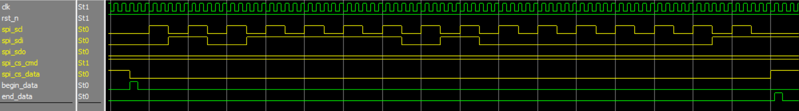

# FPGA 与 MCU 简易spi通信

## 0. Intro

​		看了些资料，觉得两种FPGA与MCU通信方式十分不错：基于状态机的指令解析与基于寄存器的硬件控制。

​		指令解析效率很高，通讯协议设计的好，几次spi传输就能实现目标效果，但状态机设计比较繁琐，设计需求一变，状态机就得重写。

​		基于寄存器的设计比较灵活，只需将FPGA的控制与配置信号设计成寄存器，由MCU改变寄存器的值即可实现对FPGA的控制。若控制信号位数少，甚至不需要spi，直接将控制信号线接到FPGA引脚上，MCU只需控制这些引脚的电平。

​		本实验实现了基于寄存器的设计，FPGA采用EP4CE15，MCU采用STM32F407。

## 1. FPGA部分

​		RTL中包含3个文件，sim中是对顶层的仿真。

​		实现目标：

- [x] reg0 = reg1 + reg2 + reg3
- [x] fifo读写
- [ ] ram读写

| 文件名        | 描述                                       |
| ------------- | ------------------------------------------ |
| design_main.v | 顶层设计                                   |
| SPI_if.v      | spi接口(interface)，对寄存器封装           |
| Drv_SPI.v     | spi的实现，使用两条ssel对cmd和data进行区分 |

### design_main.v

​		顶层。

​		利用SPI_if的寄存器接口实现需求设计。

​		FIFO需要设置为show-ahead模式。

### SPI_if.v

​		spi接口(interface)。

​		描述所需的寄存器，实现Drv_SPI模块对这些寄存器的读写与寄存器的对外接口。

​		其内部Drv_SPI模块的cmd端口用于读写的控制与寄存器地址的译码，cmd地址的最高位为0代表写，为1代表读，其余位参与地址译码。

​	

### Drv_SPI.v

​		spi的实现。

* spi采用mode0，CPOL=0，CPHA=0 。

* 使用两条ssel对cmd和data进行区分，每次spi传输时只允许使用一条ssel，传输结束时(ssel拉高)，数据会显示在对应的端口上(Dcmd/Dout)。

* cmd与data的位宽可由对应的parameter设置。

* 传输data时，标志信号begin_data与end_data分别会在传输开始前与结束后拉高一个周期。

#### 仿真

​		使用mdselsim_ase仿真，使用其他仿真器需添加altera_mf_ver仿真库。

​		直接运行sim/run.bat

## 2. MCU驱动

​		无话可说

## 3. 样例

​		摸了

