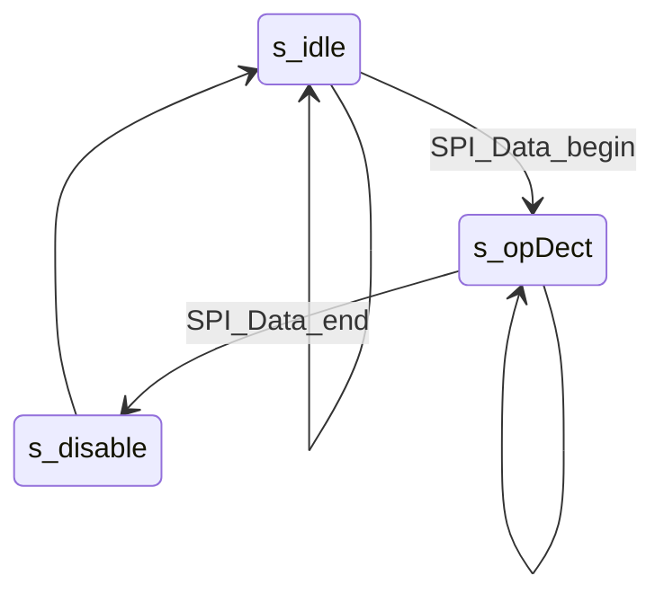
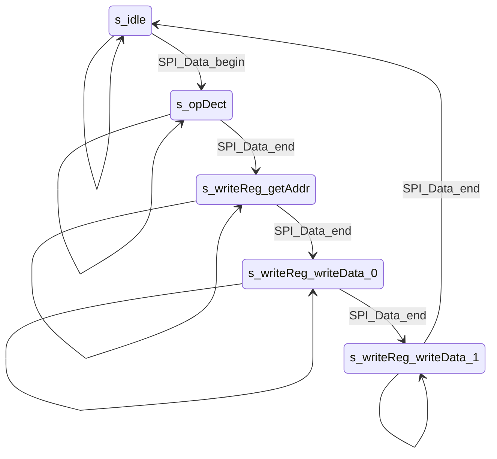
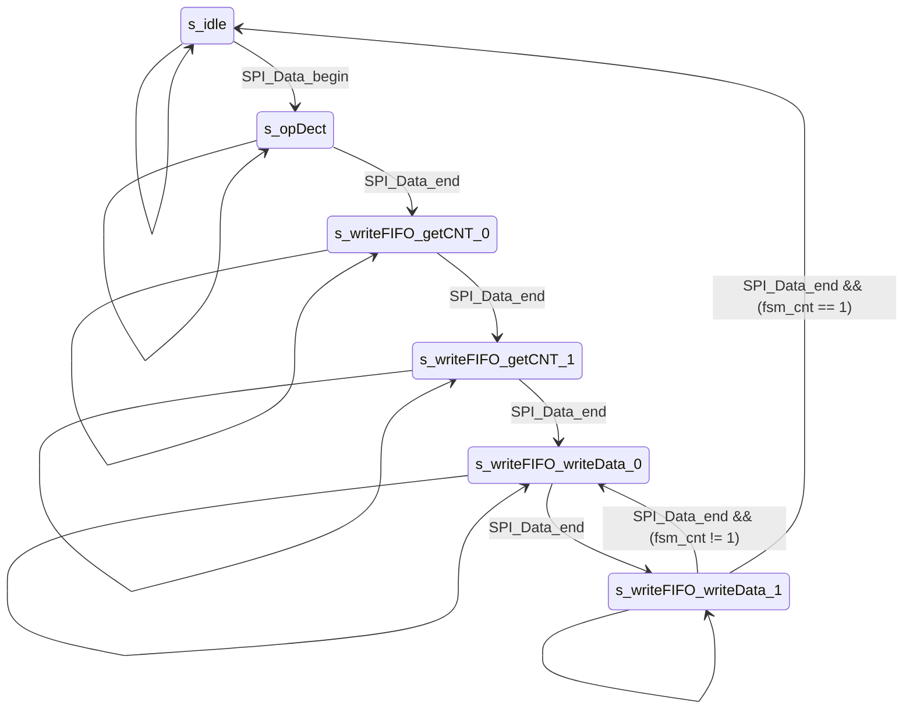
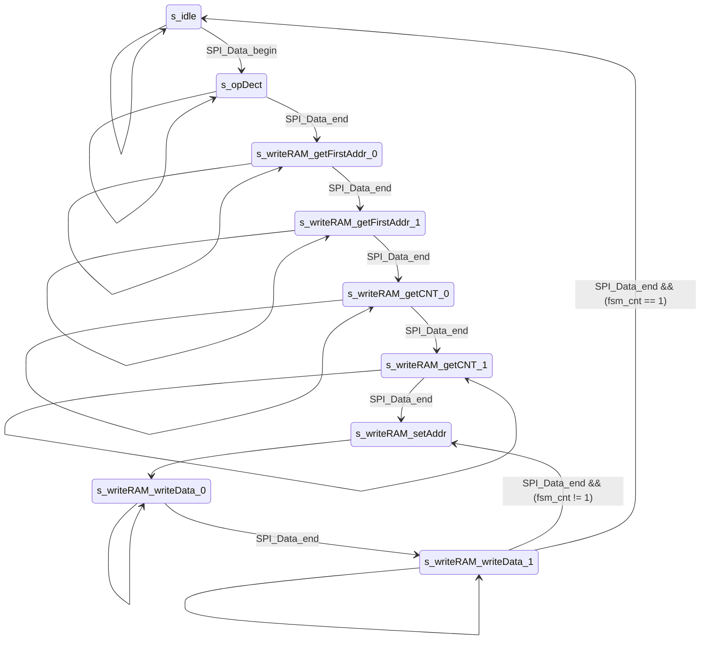

# FPGA 与 MCU 简易spi通信

## 0. Intro

​本仓库实现两种基于SPI的FPGA与MCU通讯方式：类SRAM接口与指令解析。

​不论哪种方式，MCU都是通过修改FPGA内部一些控制寄存器的值实现对FPGA硬件的控制。在类SRAM接口方式中，每一个控制寄存器与数据寄存器的读写都被分配了唯一的地址，通过指定地址，即可实现对目标寄存器的读或写操作。在指令解析方式中，则是通过状态机对MCU发送的指令进行解析，实现对目标寄存器的读写。

​本仓库分为两个部分，essential中实现了基本的读写功能，即寄存器的读写、FIFO的读写与DPRAM的读写，simpleDSP中实现了简单的数字信号处理功能，包括信号采样、FFT与IFFT、FIR滤波。

​实验中使用了Intel的IP核，并提供相应的仿真，具体的软硬件平台如下表所示。

| 平台          |                 |
| ----------- |:--------------- |
| FPGA        | EP4CE15         |
| MCU         | STM32F407       |
| **软件**      |                 |
| Quartus     | 18.1.1 Standard |
| Keil        |                 |
| STM32CubeMX | 6.5.0           |

## 1. 目录结构

**有的文件找不到，是还没做完。**

```
FPGA_MCU_SPI_COM
├── LICENSE
├── README.assert                   // README中图像
├── README.md
├── essential                       // 基础部分
│   ├── alt_ip                      // 使用到的IP核
│   ├── Inst_pars                   // 指令解析方式
│   │   ├── RTL                     // RTL实现
│   │   ├── mcu_driver              // 驱动程序
│   │   └── sim
│   │       ├── modelsim_prj
│   │       │   ├── run.do          // 仿真运行脚本
│   │       │   └── wave.do         // 波形脚本
│   │       ├── run.bat             // 启动脚本
│   │       └── tb_main.v
│   └── sram_like                   // 类SRAM接口方式
│       ├── RTL
│       ├── mcu_driver
│       └── sim                     // 与Inst_pars类似，就不展开了
└── simpleDSP                       // todo
    ├── dsp
    ├── inst_pars
    └── sram_like
```

## 2. SPI模块


​SPI模块实现了spi的从机模式，并且只支持mode 0，即上升沿采样下降沿切换。通过对scl、sel等信号的采样，判断出这些信号的上升下降沿，作出相应的动作，因此，scl的最大频率受到clk的制约。例如clk取50M，scl的频率就不能超过25M。由于仅作从机，FPGA端没有主动向MCU发起传输的能力，当MCU需要读取数据时，需要发送空数据0产生scl时钟，待读取的数据才能在sdo线（FPGA端，对应MCU端sdi线）上出现。

​Data_begin与Data_end信号作为通讯的开始与结束标志，也是Din与Dout端口数据的有效标志。在data_begin拉底前，Din端口就应准备好数据，否则Din数据无法及时地被SPI模块装载，sdo也就无法正确输出。同理，在Data_end拉高前，也不应该去读取Dout端口的数据。

## 3. essential

* 简单求和

​SPI接口模块内存在一些寄存器，并在端口处将他们引出。为了简单测试寄存器的功能，用纯组合逻辑实现了这些寄存器的求和。

* dual clk FIFO

​使用Intel的IP核，配置大小为16位*256，show ahead模式。

* dual port RAM

​使用Intel的IP核，配置大小为16位*256，区分读写时钟，读端口数据不需要寄存。

* 使能控制

对上述3点功能添加使能控制。

## 4. 类SRAM接口

SPI模块采用双sel线spi_cs_addr与spi_cs_data，以区别本次传输的数据是地址还是数据。每次读写操作时，首先传输对应端口的地址，再进行数据的收发。


模块内为每个需要通过spi访问的寄存器分配**寄存器地址**，spi传输时的地址依据**寄存器地址**分为对应寄存器的读写地址，写地址最高位为0，读地址的最高位为1，其余位与**寄存器地址**保持相同，以此区分。

| 寄存器地址 | 传输地址(8位，写操作） | 传输地址（8位，读操作） |
| ----- | ------------ | ------------ |
| 1     | 1            | 1+128        |

对于FIFO的读写操作，在首次指定地址后，允许连续的读**或**写数据。

对于所有的写操作，采用时序逻辑；对于所有的读操作，采用组合逻辑。

## 5. 指令解析接口

spi传输位宽为8位，FPGA中数据的位宽位为16位。SPI模块为标准4线SPI。

### 5.1. 指令设计

共设计了8条指令：

| 指令描述    | 操作码（首字节） |
| ------- | -------- |
| disable | 0x00     |
| enable  | 0x01     |

用于置位控制寄存器ren;

| 指令描述           | 操作码（首字节） |         |           |           |
| -------------- | -------- | ------- | --------- | --------- |
| write register | 0x02     | regAddr | regData_0 | regData_1 |
| read register  | 0x03     | regAddr | 0x00      | 0x00      |

regAddr，内部数据寄存器编址。

regData_0，16位数据的高8位。

regData_1，16位数据的低8位。

| 指令描述       | 操作码（首字节） |           |           |         |         |     |         |         |
| ---------- | -------- | --------- | --------- | ------- | ------- | --- | ------- | ------- |
| write fifo | 0x04     | dataCnt_0 | dataCnt_1 | data0_0 | data0_1 | ... | dataX_0 | dataX_1 |
| read fifo  | 0x05     | dataCnt_0 | dataCnt_1 | 0x00    | 0x00    | ... | 0x00    | 0x00    |

FIFO读写，采用连续传输。

dataCnt，16位，传输数据的长度。

当FIFO满时，多余的数据无效；FIFO空时，读出0。

| 指令描述      | 操作码（首字节） |             |             |           |           |         |         |     |         |         |
| --------- | -------- | ----------- | ----------- | --------- | --------- | ------- | ------- | --- | ------- | ------- |
| write ram | 0x06     | firstAddr_0 | firstAddr_1 | dataCnt_0 | dataCnt_1 | data0_0 | data0_1 | ... | dataX_0 | dataX_1 |
| read ram  | 0x07     | firstAddr_0 | firstAddr_1 | dataCnt_0 | dataCnt_1 | 0x00    | 0x00    | ... | 0x00    | 0x00    |

RAM读写，采用连续传输。

firstAddr，16位，为数据的首地址。（ram大小其实仅为16位*256，8位够了，设计成16位是为了通用性强点，ram深度大点指令也可以兼容，但无疑是牺牲了效率的（其实也没牺牲多少，实际应用中时间没这么紧张吧👀））

dataCnt，16位，传输数据的长度。

从首地址开始顺序读写，当数据对应的地址超出RAM上限时，写入无效，读取为0。

### 5.2. 状态机设计

采用三段式状态机，对于写操作使用时序逻辑，对于读操作使用组合逻辑。需要注意的是写操作的时序逻辑是以**现态**为准的。

**disable 与 enable**



**write register 与 read register**



**write fifo 与 read fifo**



fsm_cnt是在**s_writeFIFO_writeData_1**状态才自减的，由于状态机输出中fsm_cnt是时序逻辑并且基于**现态**，所以在状态转移中现态根据fsm_cnt转移的下一拍自减才完成。总的来说，fsm_cnt代表本数据是需要传输的倒数第fsm_cnt个数据，所以状态转移时**fsm_cnt == 1**就代表本数据是最后一个了。

**write ram 与 read ram**



## 6. simpleDSP
