[en](./README.md) | [简中](./README_cn.md)

# simple spi communication between FPGA and MCU

## 0. Intro

This repository implements two SPI-based communication methods between FPGA and MCU: ram-like and instruction parsing.

Both ways realize the modification of target registers through specific SPI protocols to control the related functional logic parts. The main difference between the two approaches is the design of the communication protocol and the implementation of the SPI interface module. ram-like approach, each accessible register is assigned an independent address, through which different registers can be accessed; the instruction parsing approach parses specific protocol instructions to operate the registers, and the relevant registers are invisible to the MCU.

This repository is divided into two parts. essential implements basic read/write functions in two ways, including register read/write, FIFO read/write and DPRAM read/write, and simpleDSP implements simple digital signal processing functions using ram-like methods, including signal sampling, FFT and IFFT, and FIR filtering (unfinished).

Intel's IP cores were used in the experiments and the corresponding simulations were provided, and the specific hardware and software platforms are shown in the following table.


| Platform     |                 |
| ------------ |:--------------- |
| FPGA         | EP4CE15         |
| MCU          | STM32F407       |
| **Software** |                 |
| Quartus (IP) | 18.1.1 Standard |
|              |                 |


## 1. Catalog structure

**There are files that can't be found that aren't done yet.**

```
FPGA_MCU_SPI_COM
├── LICENSE
├── README.assert                   // mage in README
├── README.md
├── essential                       // essential part
│   ├── alt_ip                      // IP cores used
│   ├── Inst_pars                   // Instruction parsing method
│   │   ├── RTL                     // RTL implementation
│   │   ├── mcu_driver              // Drivers
│   │   └── sim
│   │       ├── modelsim_prj
│   │       │   ├── run.do          // Simulation run scripts
│   │       │   └── wave.do         // Wave Scripts
│   │       ├── run.bat             // Startup script
│   │       └── tb_main.v
│   └── sram_like                   // ram-like method
│      ├─sim
│      ├─fsmc
│      │  ├─mcu_driver
│      │  └─RTL
│      └─spi
│          ├─mcu_driver
│          └─RTL
└── simpleDSP                       // todo

```


## 2. spi interface

### 2.1. SPI


The SPI module implements the slave mode of spi and only supports mode 0，namely, rising-edge sampling falling-edge switching。By sampling signals such as scl and sel, the rising and falling edges of these signals are judged and the corresponding actions are taken, so the maximum frequency of scl is constrained by clk. For example, if clk takes 50M, the frequency of scl cannot exceed 25M. Since it is only a slave, the FPGA side does not have the ability to initiate transmission to the MCU, when the MCU needs to read data, it needs to send null data to generate the scl clock, and then the data to be read can only appears on the sdo line(FPGA-side, corresponding to MCU-side sdi line).


The ​Data_begin and Data_end signals are used as the start and end flags for communication, and they are also valid flags for Din and Dout port data. Before Data_begin is pulled low, the Din port should be ready for data, otherwise the Din data cannot be loaded by the SPI module in time and the sdo cannot be output correctly. Similarly, the Dout port data should not be read before data_end is pulled high.


### 2.2. ram-like

#### 2.2.1. general schema


* spi interface module (spi_if)
  
  * Parses incoming spi protocols
  * Provide uniform read/write interfaces backward (addr, wdata, rdata, wen, ren)

* User registers interface module (user_regs_if)
  
  * Harmonized management of registers requiring external access

* User function module (user_func)
  
  * Main function implementation
    
    

#### 2.2.2. spi_if with instruction structure


When using the ram-like method, the spi_if module is modified on the basis of the original SPI to dual sel lines spi_cs_addr and spi_cs_data to differentiate whether the data transferred this time is address or data. The address or data will be hosted after each transfer.

Each time the MCU initiates a transfer, it first transfers addr, which determines the type of transfer (read/write) and the target register address, and then transfers data, which reads or writes the data. the highest bit of addr determines the type of transfer, with 0 representing a write transfer, 1 representing a read transfer, and the rest of the bits are used as the target register address. For example, for an 8-bit addr, the 8th bit determines the transfer type, and the lower 7 bits determine the destination register address.

| register address | addr(8-bit, write) | addr(8-bit, read) |
| ----- | ------------ | ------------ |
| 6     | 0x06         | 0x86         |


### 2.3. Instruction parsing

#### 2.3.1. General schema


* spi interface module (spi_if)

* Instruction parsing interface (ins_pars_if)

  * State machine parsing instructions
  * Similar to user register interface module (user_regs_if) for unified register management

* User function module (user_func)

  * Main function implementation
    
    

#### 2.3.2. Instruction structure

The design of the instruction in this example only considers a simple basic implementation, with no check digit, etc. The instruction consists of a number of bytes. The instruction consists of a number of bytes, the first byte is fixed as an opcode, indicating the function of the instruction, followed by a number of bytes used as parameters related to the instruction.

A simple example is provided in the essential section.


#### 2.3.3. state machine design

* Moore-type three-stage state machine (lots of states 😰)
  
  * (originally Mealy-type, with fewer states, but more complex, see commit /83315b0b /essential/Inst_pars/RTL/SPI_instPars_if.v)

* Inputs to the state machine are SPI transfer start and end flag signals (e.g. `SPI_Data_begin` and `SPI_Data_end`)


* The state names are generally `s_opcode_state_wait` and `s_opcode_state`, the former is used to wait for the arrival of the end-of-transmission flag, while the latter completes the corresponding operation within a clock and then moves to the next wait state.

* The write operation uses temporal logic and the read operation uses combinational logic. Note that the timing logic for write and the combinational logic for read are based on **next-state**. The write logic is to avoid the effect of register lag of one beat, while the read logic is because the timing of the SPI module's read operation is very strict and, as mentioned, requires data to be ready before the `Data_begin` signal is pulled low, and the `Data_begin` signal by only lasts for one beat. The state machine is based on `Data_begin` to enter the read state (the state that provides data for the SPI module, `s_*_readData`), which means that the data has to be ready before entering the read state, so it depends on the next-state.

* Specific examples can be found in the essentials section
 
  

### 2.4. ram-like vs command parsing

The ram-like approach is highly extensible, and the spi interface is generalizable to different functional requirements by simply rewriting the relevant register interfaces. In contrast to this scalability, there is a loss of efficiency, as each time a different register is manipulated, a new addr transfer needs to be initiated. One solution to this is to enable another spi and add the appropriate logic functions to specialize the transfer to handle large amounts of data.

The instruction resolution approach is stronger on efficiency, with specialized instructions ensuring efficient register operations. On the other hand, dedicated instructions also lead to non-expandability and complexity of parsing module development. If the FPGA has sufficient resources, using a soft core cpu may be a more convenient choice.


### 2.5. other protocol interfaces

#### 2.5.1. parallel port with fsmc

* Parallel transfers are logically simpler, there is no need to differentiate between reads and writes with addresses, and for RAM there is also direct access to each cell. Of course more data lines means more complex hardware design requirements.

* fsmc uses SRAM transfer protocol, A mode (OE flip-flop, turn on extended mode in cubemx configuration). 1 mode was not tested.

* The protocol interface module converts asynchronous fsmc to synchronous mode; it is also possible to read and write asynchronously to registers directly without going through the protocol interface module (regBank_async.v). (The ip core for RAM and FIFO only provides synchronous mode, so asynchronous read/write mode is not provided here as well.)
 
  

## 3. essential

### 3.1. Functional implementation

* Simple summation
  
  * There are four user registers num1, num2, num3, and sum, and sum is the sum of the first three.

* dual clk FIFO
  
  * Using Intel's IP core, configuration size is 16 bits * 256, show ahead mode.

* dual port RAM
  
  * Use Intel's IP core, configuration size is 16-bit * 256, differentiate between read and write clocks, read port data does not need to be hosted.

* Enable control
  
  * Add enable control to the above 3-point function.
    


### 3.2. ram-like

#### 3.2.1. register definition

| Address | Type | Bitwidth | Name | Description |
| --- | --- | --- | ------------------- | ------------ |
| 0   | R   | 16  | sum                 |              |
| 1   | RW  | 16  | num1                |              |
| 2   | RW  | 16  | num2                |              |
| 3   | RW  | 16  | num3                |              |
| 4   | R/W | 16  | fifo_r/fifo_w       |              |
| 5   | W   | 8   | ram_waddr           |              |
| 6   | W   | 8   | ram_raddr           |              |
| 7   | R/W | 16  | ram_rdata/ram_wdata |              |
| 8   | RW  | 1   | ctrl                | ctrl[0] - en |
|     |     |     |                     |              |


* The type of a register represents its read/write attributes; R/W means that a read or write to this address will actually operate two different registers or perform different functions.

* Registers prefixed with fifo and ram are encapsulations of the corresponding operation, and do not necessarily mean that the register really exists.

* For the register with address 4, i.e., FIFO read and write operations, multiple consecutive reads or writes can be performed.

* For all write operations, timing logic is used; for all read operations, combinational logic is used.
  


### 3.3. Instruction parsing

* The spi transmission bit width is 8 bits, and the bit width bit of data in FPGA is 16 bits. the SPI module is standard 4-wire SPI.

* Default little end order (low byte first) for multi-byte data. (⚠ but need to be set to big end-order in testbench)
  
  


#### 3.3.1. Instruction design

A total of 8 instructions are designed:

| Inst    | OP(first byte) |
| ------- | -------------- |
| disable | 0x00           |
| enable  | 0x01           |

use to set control register `ren`.

| Inst           | OP(first byte) |         |           |           |
| -------------- | -------------- | ------- | --------- | --------- |
| write register | 0x02           | regAddr | regData_0 | regData_1 |
| read register  | 0x03           | regAddr | 0x00      | 0x00      |

regAddr，internal data register address.

regData_0，regData_1，the byte order is determined by the parameter `isLittleEndian`.

| Inst       | OP(first byte) |           |           |         |         |     |         |         |
| ---------- | -------------- | --------- | --------- | ------- | ------- | --- | ------- | ------- |
| write fifo | 0x04           | dataCnt_0 | dataCnt_1 | data0_0 | data0_1 | ... | dataX_0 | dataX_1 |
| read fifo  | 0x05           | dataCnt_0 | dataCnt_1 | 0x00    | 0x00    | ... | 0x00    | 0x00    |

FIFO read and write with continuous transfer.

dataCnt，16bit，Length of transmitted data.

When the FIFO is full, the excess data is invalid; when the FIFO is empty, only read out 0.

| inst      | OP(first byte) |             |             |           |           |         |         |     |         |         |
| --------- | -------------- | ----------- | ----------- | --------- | --------- | ------- | ------- | --- | ------- | ------- |
| write ram | 0x06           | firstAddr_0 | firstAddr_1 | dataCnt_0 | dataCnt_1 | data0_0 | data0_1 | ... | dataX_0 | dataX_1 |
| read ram  | 0x07           | firstAddr_0 | firstAddr_1 | dataCnt_0 | dataCnt_1 | 0x00    | 0x00    | ... | 0x00    | 0x00    |

RAM read and write with continuous transfer.

firstAddr，16bit，the address of first data. (ram size is actually only 16 bits * 256, 8 bits is enough, designed to 16 bits is for the compatibility with large depth RAM, but undoubtedly this will sacrifice efficiency )

dataCnt，16bit, Length of transmitted data.

Read and write sequentially from the first address, when the address exceeds the RAM limit, the write is invalid and the read is 0. (The judgment is very simple, `fsm_addr_RAM >= RAM_SIZE`, overflow or whatever is not considered)


#### 3.3.2. Instruction Parsing FSM Diagrams

For simplicity, in the following schematics:

* jumps that maintain the original state when the condition is not satisfied are not shown

* The wait state is not displayed and is indicated by adding **(wait)** after the corresponding state.

##### disable 与 enable

```mermaid
stateDiagram-v2
    s_idle      --> s_idle          
    s_idle      --> s_opDect        :transBegin

    s_opDect    --> s_opDect        
    s_opDect    --> s_disable/s_enable       :transEnd
    
    s_disable/s_enable   --> s_idle
```



##### write register


##### read register


##### write fifo 与 read fifo


The self-decrease of `fsm_cnt_FIFO` is implemented by the temporal logic based on the next-state, and the value has finished the self-decrease when the current-state jumps to `s_writeFIFO_updateAndBranch`, that is **self-decrease first and then judge**, so when the value becomes 0, it means that all the data has been transferred.

##### write ram 与 read ram


## 4. simpleDSP

todo

### 4.1. Structure Block Diagram


### 4.2. User Register Definition


| addr | R/W | name      |
| ---- | --- | --------- |
| 0    | RW  | ctrl[9:0] |

- [0] en_sclkGen

- [1] en_sample

- [2] en_waveGen

- [3] en_FIR

- [4] wen_sclkGen_coef: 

write enable, The corresponding module is deactivated when write enable is active(en = en_module & (~ wen_module_coef)).

- [5] wen_FIR_coef

- [7:6] mode_sample: 
  
  - 0：continuous sampling, output to FIR only
  - 1：burst sampling (1024 points), output to RAM only
  - 2：Burst sampling (1024 points), output to FIFO only
  - 3：Burst sampling (1024 points), output to RAM snd FIFO only

- [8] sel_FIR_WaveGen

- [9] en_int：interrupt Enable

| addr | R/W | name         |
| ---- | --- | ------------ |
| 1    | W   | trigger[2:0] |

- [0] trig_sample： Set 1 to trigger a sample (1024 points), and automatically set 0 when finish
- [1] trig_FFT：    Set 1 to trigger a sample (1024 points), and automatically set 0 when finish
- [2] trig_IFFT：   Set 1 to trigger a sample (1024 points), and automatically set 0 when finish

| addr | R/W | name       |
| ---- | --- | ---------- |
| 1    | R   | state[2:0] |

- [0] busy_sample
- [1] busy_FFT
- [2] busy_IFFT

| addr | R/W | name            |
| ---- | --- | --------------- |
| 2    | R   | fifo_wave_rdata |
|      | W   | fifo_wave_wdata |
| 3    | W   | ram_wave_waddr  |
| 4    | W   | ram_wave_raddr  |
| 5    | R   | ram_wave_rdata  |
|      | W   | ram_wave_wdata  |
| 6    | W   | ram_fre_waddr   |
| 7    | W   | ram_fre_raddr   |
| 8    | R   | ram_fre_rdata   |
|      | W   | ram_fre_wdata   |
| 9    | W   | FIRcoef_waddr   |
| 10   | W   | FIRcoef_raddr   |
| 11   | R   | FIRcoef_rdata   |
|      | W   | FIRcoef_wdata   |

| addr | R/W | name                 |
| ---- | --- | -------------------- |
| 12   | RW  | sclk_gen_coef[31:16] |
| 13   | RW  | sclk_gen_coef[15:0]  |

sclk_gen_coef：Sample clock generation coefficients, similar to DDS frequency control words

## 5. todo


1. Now only the simulation, not yet the actual board verification. mcu driver has not been tested. (So for reference only
2. simpleDSP
