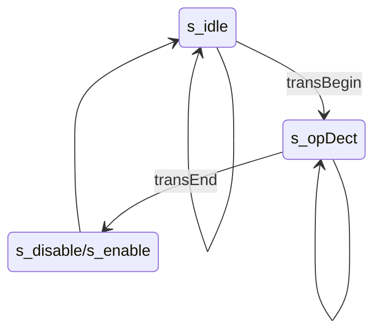
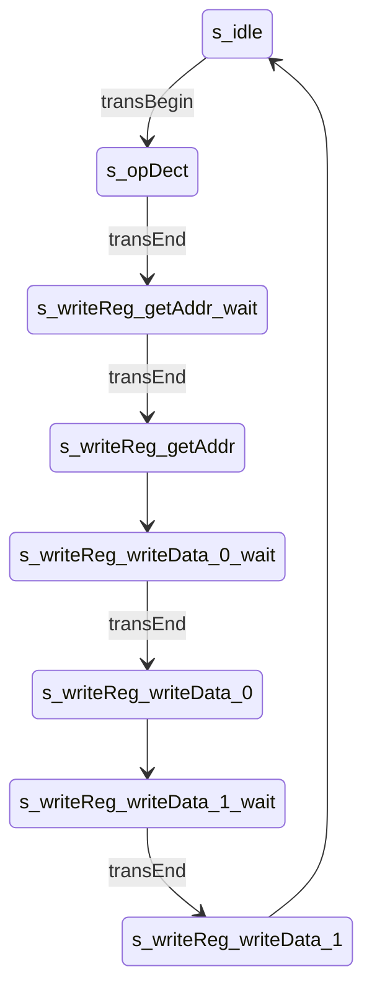
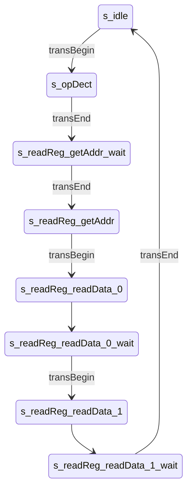
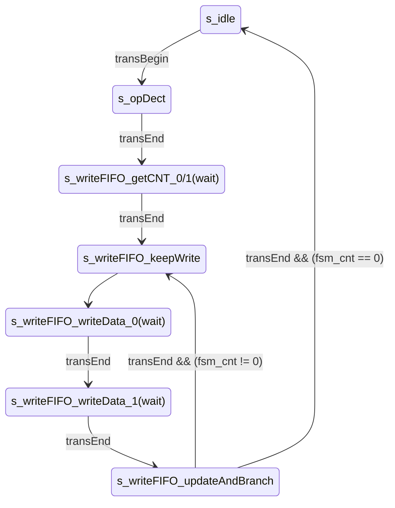
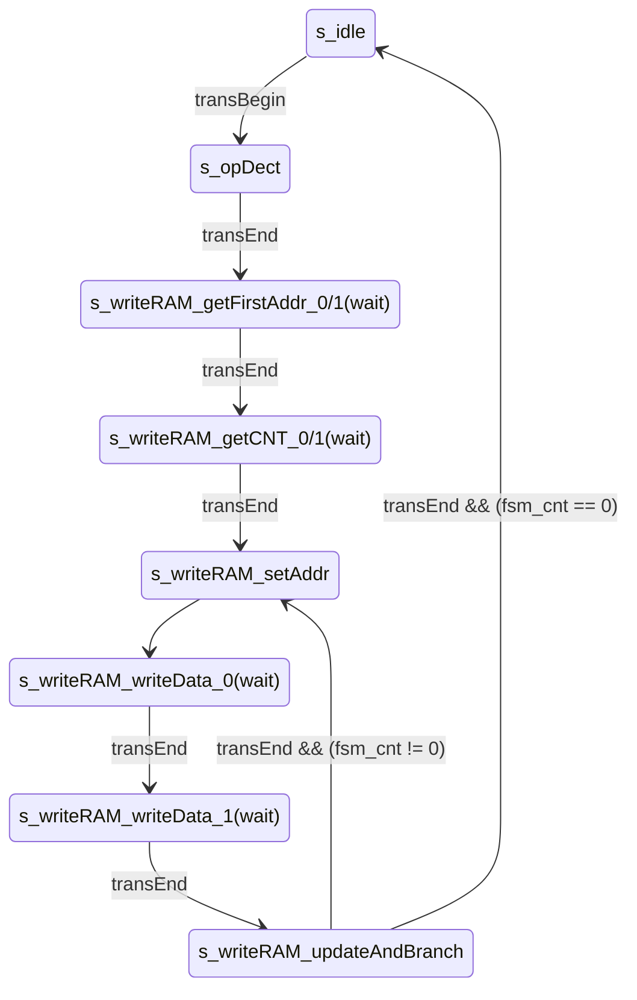

[en](./README.md) | [简中](./README_cn.md)

# FPGA 与 MCU 简易spi通信

## 0. Intro

本仓库实现两种基于SPI的FPGA与MCU通讯方式: ram-like与指令解析。

两种方式均通过特定的SPI协议，实现对目标寄存器的修改，从而控制相关的功能逻辑部分。两种方式的主要区别在于通信协议的设计与spi接口模块的实现不同。ram-like方式中，为每个可被访问的寄存器分配独立地址，通过地址来访问不同的的寄存器;指令解析方式中，则是解析特定的协议指令来操作寄存器，相关的寄存器对MCU来说是不可见的。

本仓库分为两个部分，essential中用两种方式实现了基本的读写功能，包括寄存器的读写、FIFO的读写与DPRAM的读写，simpleDSP中使用ram-like方式实现了简单的数字信号处理功能，包括信号采样、FFT与IFFT、FIR滤波（未完成）。

​实验中使用了Intel的IP核，并提供相应的仿真，具体的软硬件平台如下表所示。


| 平台           |                 |
| ------------ |:--------------- |
| FPGA         | EP4CE15         |
| MCU          | STM32F407       |
| **软件**       |                 |
| Quartus (IP) | 18.1.1 Standard |
|              |                 |


## 1. 目录结构

**有的文件找不到，是还没做完。**

```
FPGA_MCU_SPI_COM
├── LICENSE
├── README.assert                   // README中图像
├── README.md
├── essential                       // 基础部分
│   ├── alt_ip                      // 使用到的IP核
│   ├── Inst_pars                   // 指令解析方式
│   │   ├── RTL                     // RTL实现
│   │   ├── mcu_driver              // 驱动程序
│   │   └── sim
│   │       ├── modelsim_prj
│   │       │   ├── run.do          // 仿真运行脚本
│   │       │   └── wave.do         // 波形脚本
│   │       ├── run.bat             // 启动脚本
│   │       └── tb_main.v
│   └── sram_like                   // 类SRAM接口方式
│      ├─sim
│      ├─fsmc
│      │  ├─mcu_driver
│      │  └─RTL
│      └─spi
│          ├─mcu_driver
│          └─RTL
└── simpleDSP                       // todo

```


## 2. spi接口

### 2.1. SPI


SPI模块实现了spi的从机模式，并且只支持mode 0，即上升沿采样下降沿切换。通过对scl、sel等信号的采样，判断出这些信号的上升下降沿，作出相应的动作，因此，scl的最大频率受到clk的制约。例如clk取50M，scl的频率就不能超过25M。由于仅作从机，FPGA端没有主动向MCU发起传输的能力，当MCU需要读取数据时，需要发送空数据产生scl时钟，待读取的数据才能在sdo线（FPGA端，对应MCU端sdi线）上出现。

​Data_begin与Data_end信号作为通讯的开始与结束标志，也是Din与Dout端口数据的有效标志。在data_begin拉低前，Din端口就应准备好数据，否则Din数据无法及时地被SPI模块装载，sdo也就无法正确输出。同理，在Data_end拉高前，也不应该去读取Dout端口的数据。


### 2.2. ram-like

#### 2.2.1. 总模式


* spi接口模块（spi_if）
  
  * 解析接收到的spi协议
  * 向后提供统一的读写接口（addr、wdata、rdata、wen、ren）

* 用户寄存器接口模块（user_regs_if）
  
  * 统一管理需要外部访问的寄存器

* 用户功能模块（user_func）
  
  * 主体功能实现
    
    

#### 2.2.2. spi_if与指令结构


采用ram-like方式时，spi_if模块在原SPI的基础上修改为双sel线spi_cs_addr与spi_cs_data，以区别本次传输的数据是地址还是数据。每次传输完毕会将地址或数据寄存。

每次MCU发起传输时，先传输addr，决定本次传输类型（读/写）与目标寄存器地址，再传输data，读出或写入数据。addr的最高位决定了传输类型，0代表写传输，1代表读传输，余下的位均用作目标寄存器地址。例如8位的addr，第8位决定传输类型，低7位决定目标寄存器地址。

| 寄存器地址 | addr（8位，写操作） | addr（8位，读操作） |
| ----- | ------------ | ------------ |
| 6     | 0x06         | 0x86         |


### 2.3. 指令解析

#### 2.3.1. 总模式


* spi接口模块（spi_if）
* 指令解析接口（ins_pars_if）
  * 状态机解析指令
  * 类似用户寄存器接口模块（user_regs_if），统一管理寄存器
* 用户功能模块（user_func）
  * 主体功能实现
    
    

#### 2.3.2. 指令结构

本示例中指令设计只考虑简单的基本实现，无校验码等设计。指令由若干字节构成，首字节固定为操作码，指示本指令功能，后接若干字节用作指令相关参数。

essential部分中提供了一个简单示例。


#### 2.3.3. 状态机设计

* Moore型三段式状态机（状态很多😰）
  
  * （原本采用Mealy型，状态是少点，但更加复杂，可见commit /83315b0b /essential/Inst_pars/RTL/SPI_instPars_if.v）

* 状态机的输入为SPI传输的开始与结束标志信号（例如：`SPI_Data_begin`与`SPI_Data_end`）


* 状态命名一般为`s_操作码_状态_wait`与 `s_操作码_状态`，前者用于等待传输结束标志的到来，后者则在一个时钟内完成相应操作，然后进入下一个wait状态。

* 写操作使用时序逻辑，读操作使用组合逻辑。注意，写的时序逻辑和读的组合逻辑是以**次态**为准的，写逻辑是为了避免寄存器滞后一拍的影响，读逻辑则是因为SPI模块的读操作时序十分严格，如前所述，需要在`Data_begin`信号拉低前准备好数据，而`Data_begin`信号由只持续一拍。状态机中，是以`Data_begin` 为依据进入读取状态（为SPI模块提供数据的状态，`s_*_readData`），也就是说要在进入读取状态前就将数据准备好，所以要依赖次态。

* 具体例子可见essential部分
  
  

### 2.4. ram-like vs 指令解析

ram-like方式有极强的拓展性，对应不同的功能需求，只需重写相关的寄存器接口即可，spi接口是可以通用的。与强拓展性对应的是效率方面的损失，每当要操作不同的寄存器时，都需要重新发起一次addr传输。对此，一种解决方式是启用另一spi并添加相应的逻辑功能来专门传输处理大批量数据。

指令解析方式则强于效率，专用的指令保证了寄存器操作的高效。另一方面，专用的指令也导致了不可拓展性与解析模块开发的复杂性。如果FPGA资源充裕，使用软核cpu可能是个更加方便的选择。


### 2.5. 其他协议接口

#### 2.5.1. 并口与fsmc

* 并行传输在逻辑上是更简单的，无需用地址区分读写，对于RAM也可直接访问每个单元。当然数据线的增多意味着更复杂的硬件设计需求。

* fsmc采用SRAM传输协议，A模式（OE翻转，在cubemx配置中打开extended mode）。1模式并未测试。

* 协议接口模块将异步的fsmc转换为同步方式；也可以不经过协议接口模块，直接对寄存器异步读写（regBank_async.v）。（RAM与FIFO的ip核仅提供同步方式，所以这里也不提供异步读写方式）
  
  

## 3. essential

### 3.1. 实现功能

* 简单求和
  
  * 有4个用户寄存器num1、num2、num3和sum，sum为前三者的和。

* dual clk FIFO
  
  * 使用Intel的IP核，配置大小为16位*256，show ahead模式。

* dual port RAM
  
  * 使用Intel的IP核，配置大小为16位*256，区分读写时钟，读端口数据不需要寄存。

* 使能控制
  
  * 对上述3点功能添加使能控制。


### 3.2. ram-like

#### 3.2.1. 寄存器定义

| 地址  | 类型  | 位宽  | 名称                  | 说明           |
| --- | --- | --- | ------------------- | ------------ |
| 0   | R   | 16  | sum                 |              |
| 1   | RW  | 16  | num1                |              |
| 2   | RW  | 16  | num2                |              |
| 3   | RW  | 16  | num3                |              |
| 4   | R/W | 16  | fifo_r/fifo_w       |              |
| 5   | W   | 8   | ram_waddr           |              |
| 6   | W   | 8   | ram_raddr           |              |
| 7   | R/W | 16  | ram_rdata/ram_wdata |              |
| 8   | RW  | 1   | ctrl                | ctrl[0] - en |
|     |     |     |                     |              |


* 寄存器的类型代表它的读写属性，R/W代表对这个地址的读写实际会操作两个不同的寄存器，或实现不同的功能。

* 以fifo和ram作为前缀的寄存器是对相应操作的封装，并不一定代表真有这个寄存器。

* 对于地址为4的寄存器，即FIFO的读写操作，可以进行连续多次的读或写。

* 对于所有的写操作，采用时序逻辑；对于所有的读操作，采用组合逻辑。


### 3.3. 指令解析

* spi传输位宽为8位，FPGA中数据的位宽位为16位。SPI模块为标准4线SPI。

* 多字节数据默认小端序（低字节在前）。（⚠但是testbench里需要设置成大端序）
  
  

#### 3.3.1. 指令设计

共8条指令：

| 指令描述    | 操作码（首字节） |
| ------- | -------- |
| disable | 0x00     |
| enable  | 0x01     |

用于置位控制寄存器`ren`;


| 指令描述           | 操作码（首字节） |         |           |           |
| -------------- | -------- | ------- | --------- | --------- |
| write register | 0x02     | regAddr | regData_0 | regData_1 |
| read register  | 0x03     | regAddr | 0x00      | 0x00      |

regAddr，内部数据寄存器编址。

regData_0，regData_1，大小端序由parameter `isLittleEndian` 决定。


| 指令描述       | 操作码（首字节） |           |           |         |         |     |         |         |
| ---------- | -------- | --------- | --------- | ------- | ------- | --- | ------- | ------- |
| write fifo | 0x04     | dataCnt_0 | dataCnt_1 | data0_0 | data0_1 | ... | dataX_0 | dataX_1 |
| read fifo  | 0x05     | dataCnt_0 | dataCnt_1 | 0x00    | 0x00    | ... | 0x00    | 0x00    |

FIFO读写，采用连续传输。

dataCnt，16位，传输数据的长度。

当FIFO满时，多余的数据无效；FIFO空时，读出0。


| 指令描述      | 操作码（首字节） |             |             |           |           |         |         |     |         |         |
| --------- | -------- | ----------- | ----------- | --------- | --------- | ------- | ------- | --- | ------- | ------- |
| write ram | 0x06     | firstAddr_0 | firstAddr_1 | dataCnt_0 | dataCnt_1 | data0_0 | data0_1 | ... | dataX_0 | dataX_1 |
| read ram  | 0x07     | firstAddr_0 | firstAddr_1 | dataCnt_0 | dataCnt_1 | 0x00    | 0x00    | ... | 0x00    | 0x00    |

RAM读写，采用连续传输。

firstAddr，16位，为数据的首地址。（ram大小其实仅为16位*256，8位够了，设计成16位是为了通用性强点，ram深度大点指令也可以兼容，但无疑是牺牲了效率的（一般都无所谓👀））

dataCnt，16位，传输数据的长度。

从首地址开始顺序读写，当数据对应的地址超出RAM上限时，写入无效，读取为0。（判断十分简陋，`fsm_addr_RAM >= RAM_SIZE` ，溢出什么的都没考虑）


#### 3.3.2. 指令解析 FSM 图示
为简化，在后几幅示意图中：

* 条件不满足时维持原状态的跳转不显示

* wait状态不显示，以在对应状态后添加 **(wait)** 表示。

##### disable 与 enable



##### write register



##### read register



##### write fifo 与 read fifo



`fsm_cnt_FIFO` 的自减由基于次态的时序逻辑实现，现态跳转到 `s_writeFIFO_updateAndBranch` 时其值已经完成自减，即**先自减再判断**，所以值变为0时说明所有数据已传输完成。

##### write ram 与 read ram



## 4. simpleDSP

画个饼先

### 4.1. 结构框图


### 4.2. 寄存器定义

| 地址  | 读写  | 寄存器名      |
| --- | --- | --------- |
| 0   | RW  | ctrl[9:0] |

* [0] en_sclkGen

* [1] en_sample

* [2] en_waveGen

* [3] en_FIR

* [4] wen_sclkGen_coef
  系数写使能，写使能有效时对应模块失能（模块使能 = en_模块 & (~ wen_模块系数)）。

* [5] wen_FIR_coef
  系数写使能，同上。

* [7:6] mode_sample
  
  * 0：连续采样，仅输出到FIR
  * 1：突发采样(1024点)，仅输出到RAM
  * 2：突发采样(1024点)，仅输出到FIFO
  * 3：突发采样(1024点)，仅输出到RAM与FIFO

* [8] sel_FIR_WaveGen

* [9] en_int：中断使能

| 地址  | 读写  | 寄存器名         |
| --- | --- | ------------ |
| 1   | W   | trigger[2:0] |

* [0] trig_sample： 置1触发一次采样(1024点)，采样结束自动置0
* [1] trig_FFT：    置1触发一次转换(1024点)，转换结束自动置0
* [2] trig_IFFT：   置1触发一次转换(1024点)，转换结束自动置0

| 地址  | 读写  | 寄存器名       |
| --- | --- | ---------- |
| 1   | R   | state[2:0] |

* [0] busy_sample
* [1] busy_FFT
* [2] busy_IFFT

| 地址  | 读写  | 寄存器名            |
| --- | --- | --------------- |
| 2   | R   | fifo_wave_rdata |
|     | W   | fifo_wave_wdata |
| 3   | W   | ram_wave_waddr  |
| 4   | W   | ram_wave_raddr  |
| 5   | R   | ram_wave_rdata  |
|     | W   | ram_wave_wdata  |
| 6   | W   | ram_fre_waddr   |
| 7   | W   | ram_fre_raddr   |
| 8   | R   | ram_fre_rdata   |
|     | W   | ram_fre_wdata   |
| 9   | W   | FIRcoef_waddr   |
| 10  | W   | FIRcoef_raddr   |
| 11  | R   | FIRcoef_rdata   |
|     | W   | FIRcoef_wdata   |

| 地址  | 读写  | 寄存器名                 |
| --- | --- | -------------------- |
| 12  | RW  | sclk_gen_coef[31:16] |
| 13  | RW  | sclk_gen_coef[15:0]  |

sclk_gen_coef：采样时钟生成系数，类似DDS频率控制字

## 5. todo

1. 现在只进行了仿真，还未实际上板验真。mcu驱动也未测试。（所以仅供参考（逃）
2. simpleDSP（有生之年，等 ~~22~~）
